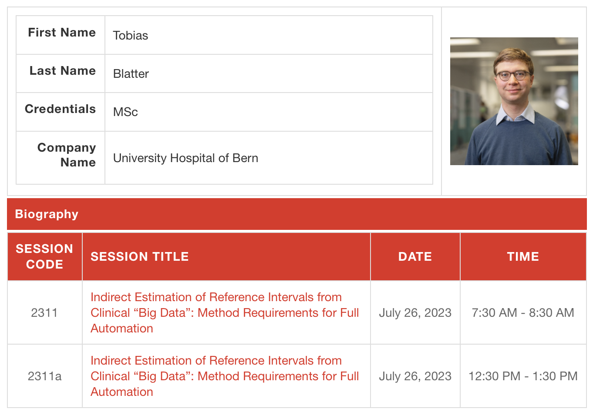
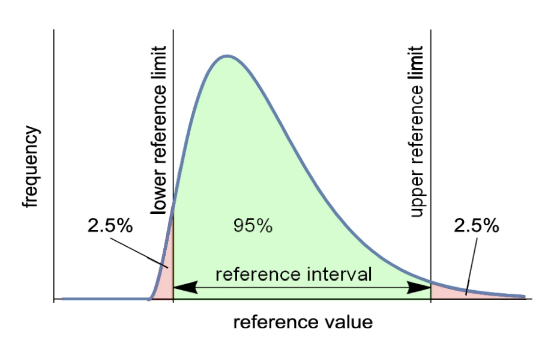
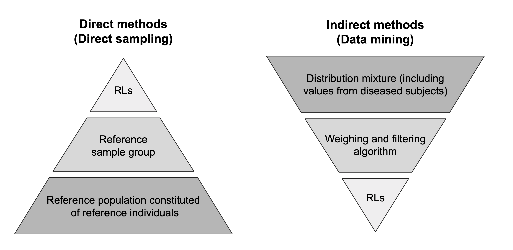
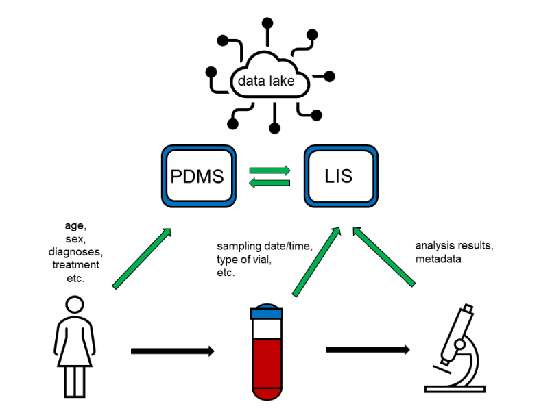
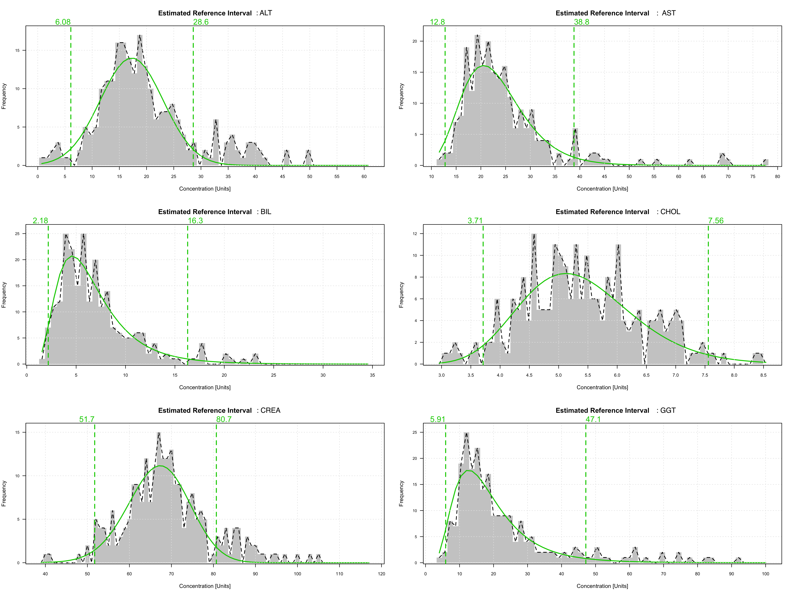
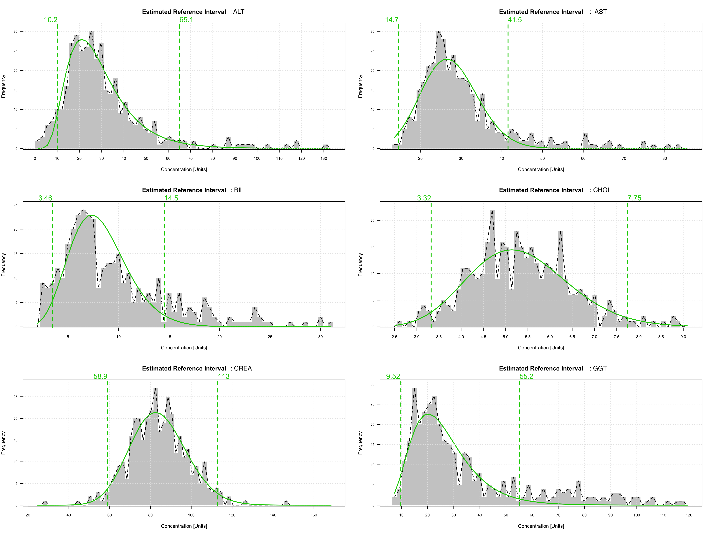
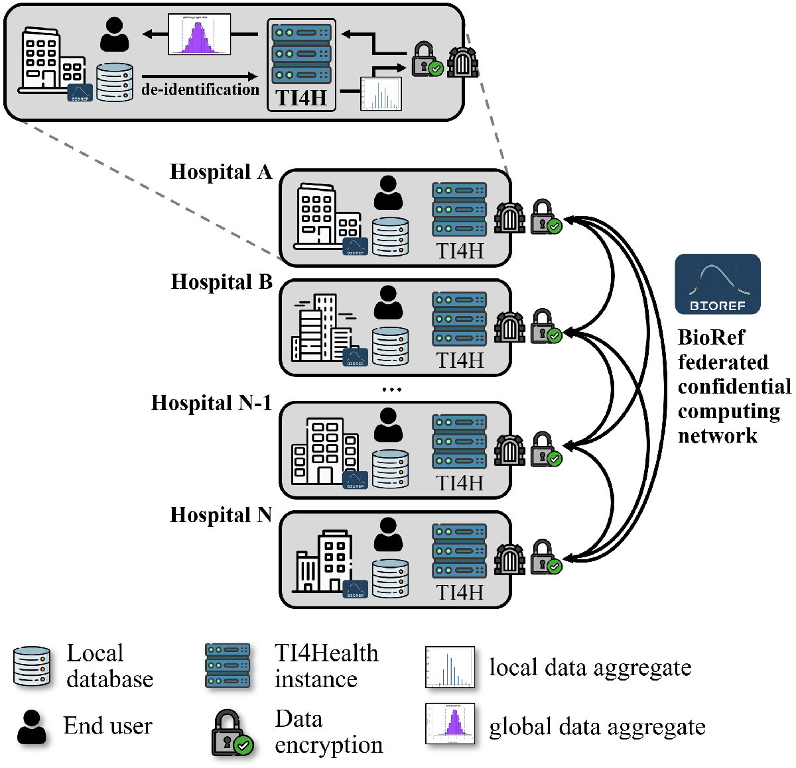
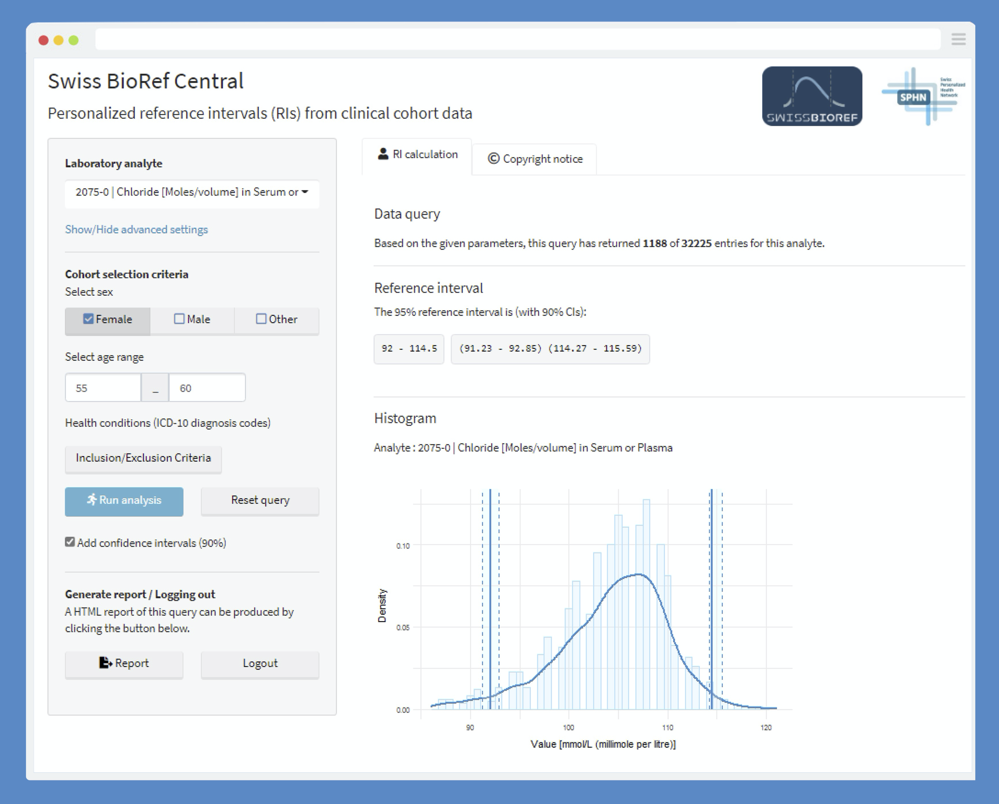
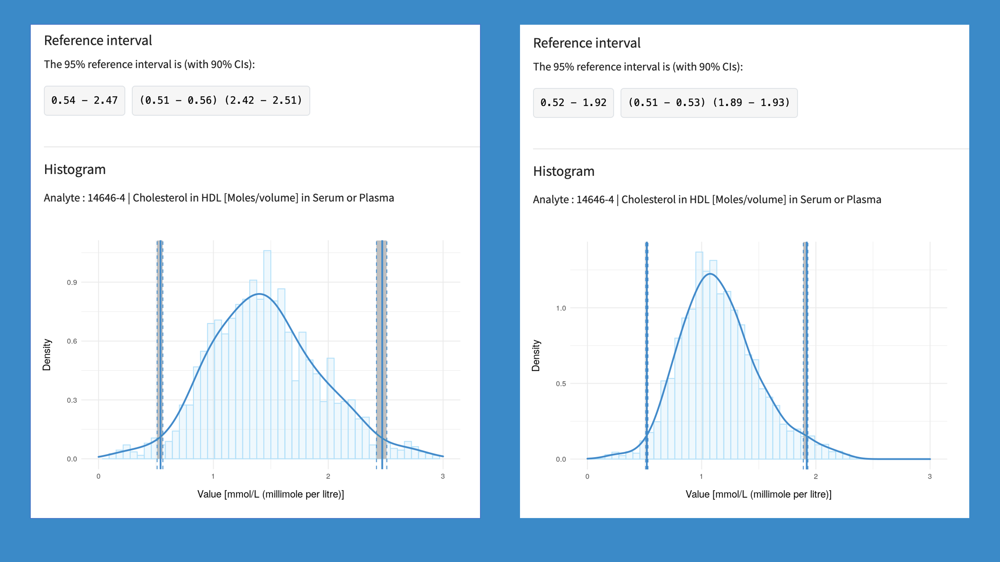

```{r setup, include=FALSE, eval=TRUE}
knitr::opts_chunk$set(echo = TRUE, out.width="80%", fig.align='center')

# Global
#setwd("~/Documents/00 Uni/00 PHD/0Research/R SCRIPTS/full automation script")

# List of required packages
required_packages <- c("dplyr", "kableExtra", "ggplot2",
                       "ggpubr", "broom", "purrr", "gridExtra", 
                       "referenceIntervals", "refineR")

# Check if each package is installed, and install it if missing
for (pkg in required_packages) {
  if (!require(pkg, character.only = TRUE)) {
    install.packages(pkg)
  }
}

# Data manipulation
library(dplyr)
library(kableExtra)
# Building and displaying plots
library(ggplot2)
library(ggpubr)
library(gridExtra)
# Advanced data table transformations
library(broom)
library(purrr)
# Package from Daniel Finnegan for direct methodologies
library(referenceIntervals)
# Package from Tatjana Ammer for the indirect refineR method
library(refineR)
```

<!---toc--->

\pagebreak

## Abstract

The evaluation of a patient's laboratory test result by the use of reference intervals (RIs) is an important part of diagnostic medicine. A variety of newer methodologies (indirect methods) have provided new possibilities to establishing RIs directly from laboratory test results collected during routine, a *Big Data* source. These novel methods can provide precise RI estimations, especially in patient groups, such as pediatric or multimorbid populations, where conventional methods are unable to. The implementation of these methods into standardized data analysis pipelines still requires general consensus regarding acceptable veracity of clinical *Big Data*, the relevant patient factors to consider, appropriate stratification procedures.

```{r sessionoverview, echo=FALSE}
#
```

## Learning Objectives

-   Name the ethical, legal, and social implications (ELSI) of indirect RI estimation from clinical *Big Data*.
-   State the most important hurdles for implementing automated RI estimation methods in clinical data analysis pipelines.

## Contact Information

Tobias Ueli Blatter, MSc Bioinformatics\
Department of Clinical Chemistry, University Hospital Bern\
Freiburgstrasse\
CH-3010 Bern\
tobias.blatter[at]extern.insel.ch\
<http://compmed.ch/>

## Disclosures

Nothing to disclose

\pagebreak

# Introduction

## Background

Reference intervals (RIs) are widely used in various medical fields to aid physicians in identifying potentially pathological states of patient's test results. They refers to a coverage of a specific range (i.e. 95%) of values obtained from a pre-defined population that help establish a baseline for comparison and interpretation of individual test results (Figure 1^[Figure adapted from Davis, C.Q. and Hamilton, R., Reference ranges for clinical electrophysiology of vision. *Doc Ophthalmol* (2021). [DOI](https://doi.org/10.1007/s10633-021-09831-1)]).

```{r defri, echo=FALSE, out.width="60%", fig.cap="The reference interval, encapsulated by the reference limit, covers a specific range of reference values."}

```

## Advancing Reference Interval Estimation
Accredited clinical laboratories need to establish and verify the RIs for the analyses they offer independently and on a regular basis by admissible international guidelines (ISO 15189:2012). The gold standard of inferring RIs has long been **direct methodologies**, where test results are sampled from a healthy reference population^[CLSI, Guideline EP28-A3c: "Defining, Establishing, and Verifying Reference Intervals in the Clinical Laboratory: Approved Guideline" (2016). [3rd Edition](https://clsi.org/standards/products/method-evaluation/documents/ep28/)] (Figure 2, left). To establish said healthy cohort, significant resources are required to assemble healthy patients across both administrative genders and relevant age-ranges. Furthermore, the absence of a comprehensive definition for "health" that encompasses both the normative elements (*well-being* and *functioning*), and the descriptive elements related to health evaluation (*test result assessment*), it is often difficult to establish reference populations across the different patient groups (i.e. pregnant, chronically ill, or older patients) present in a general admission hospital.

```{r dirvsindir, echo=FALSE, out.width="80%", fig.cap="The different approaches that direct and indirect methodologies (methods) take to estimated the reference limits (RLs) from the underlying data."}

```
**Indirect methodologies** of RI estimation offer a way to address the aforementioned shortcomings, as they sample and weight test results directly from a mixed clinical population, which contains both "physiological" (non-pathological) and pathological test results from routine patients (Figure 2, right). As some of these indirect methods have been developed fairly recently, they need to be validated across many different data sets and adapted to be integrated into standard data analysis pipelines. The IFCC Committee for Reference Intervals and Decision Limits ([C-RIDL](https://ifcc.org/ifcc-scientific-division/sd-committees/c-ridl/)) is driving this effort and guides the ongoing process. This script follows the recommendations of reference interval estimation from clinical routine data laid out by the committee^[Jones, G.R.D., C-RIDL, *et al.*, Indirect Methods for Reference Interval Determination - Review and Recommendations, *Clinical Chemistry and Laboratory Medicine* (2018). [DOI](https://doi.org/10.1515/cclm-2018-0073)].

## The Clinical Use of Big Data

Among medical disciplines, laboratory medicine has consistently embraced a high level of digitization. The data generated during clinical routine, being collected for screening, diagnostic or monitoring purposes, adheres to high-quality specifications and reproducibility standards. This data embodies three important pillars of *Big Data*: **Volume** (Amount of data), **Variety** (Diversity of data) and **Veracity** (Accuracy of data). Laboratory data can be augmented with valuable metadata (i.e. patients' demographic information) from the hospital's IT systems, if this metadata is encoded in adherence to international standards (Figure 3^[Blatter, T.U., *et al.*, Big Data in Laboratory Medicine - FAIR Quality for AI?, *Diagnostics* (2022). [DOI](https://doi.org/10.3390/diagnostics12081923)]).

```{r bigdata, echo=FALSE, out.width="50%", fig.cap="Patients’ data is entered into the patient data management system (PDMS), predominantly manually, while information about samples collected as well as about analyses conducted is entered into the laboratory information system (LIS), either manually or automatically. PDMS and LIS should be connected to form “data lakes”, comprising of various types of interlinked data."}

```

Effectively operational clinical data requires clear adherence to international encoding standards, efficient ETL (Extract, Transform, Load) processes, careful data governance, and modern data security solutions^[Blatter, T.U., *et al.*, Big Data in Laboratory Medicine - FAIR Quality for AI?, *Diagnostics* (2022). [DOI](https://doi.org/10.3390/diagnostics12081923)]. Consistency in data is beneficial for both clinical practice and clinical research. In the age of artificial intelligence (AI) and machine learning, it is important for laboratory medicine as a scientific discipline to embrace well-curated and highly-enriched data in order to thrive.

**Encoding** of laboratory (meta-)data ensures consistency and interoperability, enables seamless integration and utilizes the data within a *Big Data* framework. Globally Unique, Persistent and Resolvable Identifiers (GUPRIs) are needed for any variables associated with the measurement collection and testing procedure. A variety of nomenclatures have been established (non-exhaustive list):

1.  [LOINC](https://loinc.org) (Logical Observation Identifiers Names and Codes) - A standardized coding system for laboratory and clinical observations, providing unique identifiers for various laboratory tests and measurements.
2.  [GUDID](https://www.fda.gov/medical-devices/unique-device-identification-system-udi-system/global-unique-device-identification-database-gudid) (Global Unique Device Identification Database) - A database containing unique identifiers for medical devices.
3.  [EUDAMED](https://health.ec.europa.eu/medical-devices-eudamed_en) (European Database on Medical Devices) - A database for the registration and identification of medical devices in the European Union.
4.  [GMDN](https://www.gmdnagency.org/using-gmdn/) (Global Medical Device Nomenclature) - A nomenclature system used to classify medical devices.
5.  [EMDN](https://webgate.ec.europa.eu/dyna2/emdn/) (European Medical Device Nomenclature) - A nomenclature system specific to Europe for classifying medical devices.

In order to facilitate the accessibility of *Big Data* in laboratory medicine, data must be prepared through **efficient** and **reliable ETL processes**. Here, a few international standards, such as the [FHIR](https://www.hl7.org/fhir/) (Fast Healthcare Interoperability Resources) and the Resource Description Framework ([RDF](https://www.w3.org/TR/rdf-schema/)), provide a framework and query language for representing and querying healthcare data in a standardized manner.\

**Scalable bioinformatics infrastructures** help to manage observational data from different sources with the help of a common underlying data model and standardized vocabulary for organizing and analyzing electronic health record (EHR) data. Especially noteworthy are the Observational Health Data Sciences and Informatics ([OHDSI](https://ohdsi.github.io/TheBookOfOhdsi/)) collaborative and the [i2b2](https://www.i2b2.org) (Informatics for Integrating Biology and the Bedside) tranSMART Foundation, which both offer open-source and open-data models designed for organizing healthcare data.

The increasing availability of large volumes of clinical data highlights the importance to address novel ethical concerns related to *Big Data*: In a *Big Data* set, it's is detrimental that the individual's privacy is protected and the individual's consent in participation is respected. Not only is careful **data governance** required, but also the hindrance of re-identification of individual patients from high-dimensional data (i.e. by differential privacy[^6]) and newer models of consent management (i.e. providing patient-centric consent management[^7]) have to be implemented from the beginning of the clinical data management. Furthermore, aggregated data cannot be considered by default anonymized data anymore. Aggregated data has the potential to reveal information about individuals (e.g., membership in a sensitive cohort, undisclosed private/sensitive attributes) through statistical inference even if the data itself does not directly identify specific persons[^8].

[^6]: Ficek, J., *et al.*, Differential Privacy in Health Research: A Scoping Review., *Journal of the American Medical Informatics Association*, (2021), [DOI](https://doi.org/10.1093/jamia/ocab135)

[^7]: Tith, D., *et al.*, Patient Consent Management by a Purpose-Based Consent Model for Electronic Health Record Based on Blockchain Technology, *Healthcare Informatics Research*, (2020), [DOI](https://doi.org/10.4258/hir.2020.26.4.265)

[^8]: Raisaro, J. L., *et al.*, Addressing Beacon Re-Identification Attacks: Quantification and Mitigation of Privacy Risks, *Journal of the American Medical Informatics Association*, (2017), [DOI](https://doi.org/10.1093/jamia/ocw167)

Access to laboratory data must be carefully managed and compliance with regulatory requirements and ethical approval is crucial before access is given. Before any use of clinical data for research purposes, the link between the laboratory measurement (with metadata) and the ID of the patient has to be either reversibly removed (de-identification) or fully removed (anonymization). Compliance with (inter-)national data protection laws (see [GDPR and research](https://www.ukri.org/about-us/policies-standards-and-data/gdpr-and-research-an-overview-for-researchers/)) is non-negotiable to ensure the protection of individuals' privacy and confidentiality.

\newpage

# Case Study: Reference Intervals Estimation

## Data Source

In this script, we'll be using a modified [HCV](https://doi.org/10.24432/C5D612) data set, provided by the UC Irvine Machine Learning Repository (CC BY 4.0 license). The modified data set contains laboratory test results of 615 potential blood donors. For each patient, the person's age (in years), sex (f,m) and measurements of 6 laboratory analytes are recorded.

## Data Preparation

```{r}
# Read the csv 
dt <- read.csv(file = "data/hcvdat0.csv", sep = ";")
# Show the head of the data
knitr::kable(head(dt, 2), format = "pipe")
```

The following analytes are recorded:

| Code | Full name                  | LOINC Unit |     |     |
|------|----------------------------|------------|-----|-----|
| ALT  | Alanine Aminotransferase   | U/L        |     |     |
| AST  | Aspartate Aminotransferase | U/L        |     |     |
| BIL  | Bilirubin                  | µmol/L     |     |     |
| CHOL | Cholesterol                | mg/dL      |     |     |
| CREA | Creatinine                 | mg/dL      |     |     |
| GGT  | Gamma-Glutamyl Transferase | U/L        |     |     |

## Data Exploration

The use of the HCV data is beneficial, as for every person (row) it is indicated whether or not the person was deemed eligible for a blood donation and we can therefore assume that they are seemingly "healthy". In the data there are also some people recorded that were not qualified for blood donation due to an underlying medical condition, which could result in potentially pathological measurement for some analytes.

```{r}
# Shows the amount of patients (female & male) per category
knitr::kable(table(dt[,c(1,3)]),
             format = "pipe")
```

The different analytes present the following distributions (see Figure 4). To visually assess if the analytes (grouped by "health status") follows a normal distribution, a Q-Q-plot is used to comparing the quantiles of the data against the quantiles of a theoretical normal distribution (Figure 5).

```{r histograms, cache=TRUE, echo=FALSE, warning=FALSE, fig.width=8, fig.height=10.5, out.width="80%", fig.cap = "Full histogram of the six analytes from the dataset. There are extreme values present in the reference distribution of some analytes (AST, BIL, CREA)."}
# List of histograms
histogram_plots <- list(); i = 1

# Loop over the data to create the total histograms
for(ana in colnames(dt)[4:9]){
  histogram_plots[[i]] <- dt %>% group_by(Category) %>% 
    dplyr::select(Category, !!sym(ana)) %>% 
    filter(!is.na(!!sym(ana))) %>%
    ggplot(., aes(x = !!sym(ana), fill = Category)) + 
    geom_histogram(bins = 50, position="stack") + 
    xlab("Unit") +
    ylab("Count") +
    ggtitle(paste("Analyte:", ana)) + 
    theme_bw()
  # Iteration
  i = i + 1
}

# Plot the histograms
ggarrange(plotlist = histogram_plots,
          ncol = 2, nrow = 3, 
          common.legend = TRUE, legend = "bottom")
```

```{r qqplot, cache=TRUE, echo=FALSE, warning=FALSE, fig.width=8, fig.height=10.5, out.width="80%", fig.cap = "Quantile-Quantile (Q-Q) plots of the six analytes from the dataset. The assumption of a Gaussian distribution for the main mode of the data (\"blood donors\") can for most analytes be guaranteed. \"Outliers\" are mostly originating from the diseased populations (\"1=Hepatitis\", \"2=Fibrosis\" or \"3=Cirrhosis\")."}

# List of QQ plots
qq_plots <- list(); i = 1

# Loop over the data to create the QQ plots
for(ana in colnames(dt)[4:9]){
  qq_plots[[i]] <- dt %>% 
    filter(!is.na(!!sym(ana))) %>%
    
    ggplot(., aes(sample = !!sym(ana), colour = factor(Category))) + 
    stat_qq() +
    stat_qq_line() +
    ggtitle(paste("QQ plots:", ana)) + 
    theme_bw()
  # Iteration
  i = i + 1
}

# Plot the histograms
ggarrange(plotlist = qq_plots,
          ncol = 2, nrow = 3, 
          common.legend = TRUE, legend = "bottom")
```

\newpage

```{r, echo=FALSE}
# Data Cleaning

# Removing non-relevant values
dt <- dt %>% 
  mutate(ALT.out = case_when( between(ALT, 0, 125) ~ FALSE, TRUE ~ TRUE )) %>%
  mutate(AST.out = case_when( between(AST, 0, 100) ~ FALSE, TRUE ~ TRUE )) %>%
  mutate(BIL.out = case_when( between(BIL, 0, 70) ~ FALSE, TRUE ~ TRUE )) %>%
  mutate(CHOL.out = case_when( between(CHOL, 2.5, 10) ~ FALSE, TRUE ~ TRUE )) %>%
  mutate(CREA.out = case_when( between(CREA, 0, 150) ~ FALSE, TRUE ~ TRUE )) %>%
  mutate(GGT.out = case_when( between(GGT, 0, 200) ~ FALSE, TRUE ~ TRUE ))
```

## Data Stratification

### By Sex

For the distinct variable "Sex", we can use a one-way ANOVA to see whether or not the values for each analyte should be stratified. ANOVA (Analysis of Variance) is used to test for significant differences in means among two or more groups. In this case, the groups are defined by the levels of the "Sex" variable (m / f). The table below shows the result of the ANOVA for each analyte:\

```{r, echo=FALSE, cache=TRUE, warning=FALSE, fig.align='center'}
# List of anova results
anova_results <- list()

# Perform one-way ANOVA for each analyte and extract the ANOVA summary
for (ana in colnames(dt)[4:9]) {
  anova_results[[ana]] <- dt %>%
    dplyr::select(Sex, !!sym(ana), !!sym(paste0(ana,".out"))) %>% 
    filter(!!sym(paste0(ana,".out")) == FALSE) %>%
    select(-!!sym(paste0(ana,".out"))) %>%
    filter(!is.na(!!sym(ana))) %>%
    do(anova_result = tidy(anova(lm(!!sym(ana) ~ Sex, data = .))))
}

# Combine the tibbles from the list into a single tibble
anova_summary <- bind_rows(anova_results, .id = "Analyte")

# Extract relevant ANOVA summary columns using map from purrr
anova_summary <- anova_summary %>%
  mutate(F_value = round(map_dbl(anova_result, ~ .x$statistic[1]), 3),
         p_value = map_dbl(anova_result, ~ .x$p.value[1]) ) %>%
  arrange(p_value) %>%
  mutate(p_value = formatC(p_value, format = "e", digits = 2)) %>%
  select(Analyte, F_value, p_value)

# Print the ANOVA summary table
knitr::kable(anova_summary)

```

\
The following observations between male and female patients can be made:  

1.  Significant differences in mean values were observed for CREA, ALT, GGT, BIL, and AST (p < 0.001 for all).
2.  No significant difference in mean values was found for CHOL (p > 0.05).

The figure on the next page shows the "Sex" stratification (Figure 6). If multiple distinct (non-continuous) variables are considered for stratification the *Ichihara method* can be used. This method utilizes a nested ANOVA (two- or three-level) and separates sources of variations (SD) into three components[^9]. The relative magnitude of each SD is expressed as its ratio to between-individual SD. With this, confounding influences of other factors can be handled, allowing judgment on the necessity of partitioning after adjusting for these variables.

[^9]: Ichihara, K. and James, C.B., An Appraisal of Statistical Procedures Used in Derivation of Reference Intervals., *Clinical Chemistry and Laboratory Medicine*, (2010), [DOI](https://doi.org/10.1515/CCLM.2010.319)

```{r histogramssex, cache=TRUE, echo=FALSE, warning=FALSE, fig.width=8, fig.height=10.5, out.width="80%", fig.cap = "Full histogram of the six analytes from the dataset, stratified by sex (m and f)."}
# List of histograms
histogram_sex_plots <- list(); i = 1

# Loop over the data to create the histograms
for(ana in colnames(dt)[4:9]){
  histogram_sex_plots[[i]] <- dt %>% group_by(Sex) %>% 
    dplyr::select(Sex, !!sym(ana), !!sym(paste0(ana,".out"))) %>% 
    filter(!!sym(paste0(ana,".out")) == FALSE) %>%
    select(-!!sym(paste0(ana,".out"))) %>%
    filter(!is.na(!!sym(ana))) %>%
    ggplot(., aes(x = !!sym(ana), fill = Sex)) + 
    geom_histogram(bins = 50, position="dodge") + 
    xlab("Unit") +
    ylab("Count") +
    ggtitle(paste("Analyte:", ana)) + 
    theme_bw()
  
  # Iteration
  i = i + 1
}

# Plot the histograms
ggarrange(plotlist = histogram_sex_plots,
          ncol = 2, nrow = 3, 
          common.legend = TRUE, legend = "bottom")
```

\newpage

### By Age

For continuous variables such as age, scatter plots can be used to help visualize the relationship between the continuous variable and the test measurement. For analytes showcasing regression between age and measurement, one should consider introducing relevant breakpoints (1 vs. 5 vs. 10 years depending on the available sample size).\ 

```{r scatterplots, cache=TRUE, echo=FALSE, warning=FALSE, fig.width=8, fig.height=8.5, out.width="80%", fig.cap = "Scatterplots of the six analytes, showcasing the relationship between the patients' age and the measurement"}
# List of histograms
scatter_age_plots <- list(); i = 1

# Loop over the data to create the histograms
for(ana in colnames(dt)[4:9]){
  scatter_age_plots[[i]] <- dt %>% group_by(Category) %>% 
    filter(!!sym(paste0(ana,".out")) == FALSE) %>%
    select(-!!sym(paste0(ana,".out"))) %>%
    filter(!is.na(!!sym(ana))) %>%
    ggplot(., aes(x = Age, y = !!sym(ana), color = Category)) +
    geom_point(size = 1, alpha = 0.6) +
    labs(title = paste("Scatter Plot of Age vs.", ana),
         x = "Age",
         y = "Unit") +
    theme_bw()
  
  # Iteration
  i = i + 1
}

# Plot the histograms
ggarrange(plotlist = scatter_age_plots,
          ncol = 2, nrow = 3, 
          common.legend = TRUE, legend = "bottom")
```
\newpage

One has to consider that by age stratification, the sample sizes for each stratum might be significantly reduced and fewer reference values are available in the data. 

```{r, include = TRUE, echo=FALSE, cache=TRUE, out.height="50%", warning=FALSE, fig.align='center'}
# Select the 'Age' column using dplyr
age_data <- dt %>%
  select(Age)

# Create a histogram using ggplot2
ggplot(age_data, aes(x = Age)) +
  geom_histogram(binwidth = 10, boundary = 0, fill = "lightblue", color = "black") +
  labs(title = "Histogram of People's Age (10 year stratification)", x = "Age", y = "Frequency") + 
  theme_classic() + 
  geom_hline(yintercept = 120, linetype = "dashed", color = "red")
```

Apart from considering separate partitions, another approach is to create smoothed reference intervals (i.e. *continuous reference intervals*), which can be useful for graphical data analysis. This approach may be particularly beneficial when dealing with data from the pediatric age group (usually very low sample sizes). 


\newpage

# Reference Interval Estimation

## Traditional Methods

To calculate RIs by a direct methodologies we use the established *referenceIntervals* package[^10]

[^10]: Finnegan, D. "referenceIntervals: Reference Intervals." from *CRAN, the Comprehensive R Archive Network*, 2022. [CRAN](https://CRAN.R-project.org/package=referenceIntervals)
```{r, eval=FALSE, include=TRUE, echo=TRUE}
# Calculates the reference and confidence intervals (CIs)
# Methods: "p" (default) for parametric 
#          "n" for non-parametric 
#          "r" for robust method

ri_direct <- refLimit(data = x,
                      # + e.g. Horn method for outlier removal
                      # --> [Q1 - 1.5 IQR, Q3 + 1.5 IQR]
                      out.method = "horn", out.rm = TRUE,
                      
                      # Parametric method
                      RI = "n", refConf = 0.95, 
                      
                      # Bootstrapping CIs
                      CI = "n", 
                      limitConf = 0.9)
```

\newpage

### Non-parametric method

For the six analytes (stratified by Sex), this results in the following RIs: \ 

```{r, echo=FALSE}
# Initiation
dt_analyte_sex = list()

# Seperate the data by Analyte and Sex
dt_analyte_sex <- dt %>%
  group_by(Sex) %>%
  group_split() %>%
  map(~ .x %>%
        select(colnames(dt)[4:9]))  # Select specific columns for each group


# Apply the refLimit function to each group separately and extract the reference intervals
rls_direct_np <- purrr::map_dfr(dt_analyte_sex, ~ map(.x, ~ refLimit(data = .x, 
                                                                   out.method = "vanderLoo", 
                                                                   out.rm = TRUE, 
                                                                   RI = "n", CI = "n", 
                                                                   refConf = 0.95, 
                                                                   limitConf = 0.9, 
                                                                   bootStat = "bca")$Ref_Int)) %>% 
  t() %>% round(. , digits = 2)

# Add column names to the data frame
colnames(rls_direct_np) <- c("Male", "", "Female", "")
Analyte <- rep(c("Lower RL", "Higher RL"), times = 2)

# Print the resulting table
knitr::kable(rbind(Analyte, rls_direct_np), format = "pipe")
```

```{r np, cache=TRUE, echo=FALSE, fig.width=10, fig.height=7.5, out.width="100%", fig.cap = "Estimated non-parametric RIs on the global histograms (stratified by Sex)"}
colors <- ggplot_build(histogram_sex_plots[[1]])$data[[1]]$fill %>% unique()

# Function to add vertical lines to a plot
add_vertical_lines_male <- function(plot, x_intercepts) {
  plot + geom_vline(xintercept = x_intercepts, linetype = 1, linewidth = 1.1, color = colors[1])
}
add_vertical_lines_female <- function(plot, x_intercepts) {
  plot + geom_vline(xintercept = x_intercepts, linetype = 1, linewidth = 1.1, color = colors[2])
}

# Define the x_intercepts for each histogram
x_intercepts_male <- as.list(as.data.frame(t(rls_direct_np[,1:2])))
x_intercepts_female <-  as.list(as.data.frame(t(rls_direct_np[,3:4])))

# Use map2() to add vertical lines to each plot in the list
histogram_sex_plots_np <- map2(histogram_sex_plots, x_intercepts_male, 
                               add_vertical_lines_male)
histogram_sex_plots_np <- map2(histogram_sex_plots_np, x_intercepts_female,
                               add_vertical_lines_female)

# Plot the histograms
ggarrange(plotlist = histogram_sex_plots_np,
          ncol = 2, nrow = 3, 
          common.legend = TRUE, legend = "bottom")
```


### Parametric method

For the six analytes (stratified by Sex), this results in the following RIs: \ 

```{r, echo=FALSE}
# Apply the refLimit function to each group separately and extract the reference intervals
rls_direct_p <- purrr::map_dfr(dt_analyte_sex, ~ map(.x, ~ refLimit(data = .x, 
                                                                    out.method = "vanderLoo", 
                                                                    out.rm = TRUE, RI = "p", 
                                                                    CI = "p", 
                                                                    refConf = 0.95, 
                                                                    limitConf = 0.9, 
                                                                    bootStat = "bca")$Ref_Int)) %>% 
  t() %>% round(. , digits = 2)

# If estimates are negative --> set to zero
rls_direct_p[which(rls_direct_p < 0)] <- 0

# Add column names to the data frame
colnames(rls_direct_p) <- c("Male", "", "Female", "")
Analyte <- rep(c("Lower RL", "Higher RL"), times = 2)

# Print the resulting table
knitr::kable(rbind(Analyte, rls_direct_p), format = "pipe")
```


```{r p, cache=TRUE, echo=FALSE, fig.width=10, fig.height=7.5, out.width="100%", fig.cap = "Estimated parametric RIs on the global histograms (stratified by Sex)"}
# Define the new x_intercepts for each histogram
x_intercepts_male <- as.list(as.data.frame(t(rls_direct_p[,1:2])))
x_intercepts_female <-  as.list(as.data.frame(t(rls_direct_p[,3:4])))

# Use map2() to add vertical lines to each plot in the list
histogram_sex_plots_p <- map2(histogram_sex_plots, x_intercepts_male, 
                               add_vertical_lines_male)
histogram_sex_plots_p <- map2(histogram_sex_plots_p, x_intercepts_female,
                               add_vertical_lines_female)

# Plot the histograms
ggarrange(plotlist = histogram_sex_plots_p,
          ncol = 2, nrow = 3, 
          common.legend = TRUE, legend = "bottom")
```

## Indirect Estimation Approach

For indirect methods, usually 1000 subjects are considered a small sample size and above 10,000 as a large sample size. In populations that are underrepresented in a database (e.g., extremes of age), smaller sample sizes can be considered. <!---A minimum of 400 reference individuals for each partition is currently recommended to ensure statistically reliable RI calculations. ---> 

### Using refineR

The refineR algorithm was recently described and is provided as an open-source R-package (see https://CRAN.R-project.org/package=refineR)^[Ammer, T., *et al.*, refineR: A Novel Algorithm for Reference Interval Estimation from Real-World Data, *Nature Scientific Reports*, (2021), [DOI](https://doi.org/10.1038/s41598-021-95301-2)]. The algorithm can estimate RIs from real-world data consisting of a mixed distribution of non-pathological and pathological test results. It is assumed that the majority of test results in the input data set are non-pathological and that their distribution can be described by a Box-Cox transformed normal distribution. Further, it is presumed that a region of test result concentrations exists, where the fraction of pathological test results is negligible. The shape of the distribution of pathological test results can be arbitrary. Two steps are required: 

1) Define Sex and Age partition (if considering an analyte with sex or age dependency), and ensure population and assay stability by applying and reviewing quality control measures. Arbitrary outlier exclusion or data truncation is not required.  

2) Apply the refineR algorithm with the default 1-parameter Box-Cox transformation to estimate a model of the non-pathological distribution (for each partition).

\newpage

### Running refineR

Here, *refineR* finds the RIs from mixed routine data ($x$) using the function `findRI()` (the default function runs with a 1-parameter Box-Cox transformation):

```{r, eval=FALSE, echo=TRUE, include=TRUE}
# Estimate the model parameters by
fit <- findRI(Data= x )

# Print summary of estimated model
print(fit)

# Or just the estimated RIs
getRI(fit)

# The default plotting function 
plot(fit)
```

The following RI can be generated: \

```{r, eval=FALSE, echo=FALSE, cache=TRUE, include=FALSE}
# Apply the refLimit function to each group separately 
# and extract the reference intervals
# List of histograms
refineR_fits_male <- list()
refineR_fits_female <- list()

for (ana in colnames(dt)[4:9]) {
  refineR_fits_male[[ana]] <- dt %>%
    filter(Sex == "m") %>%
    select(!!sym(ana)) %>%
    unlist() %>%
    findRI(Data = ., NBootstrap = 15)
  
  refineR_fits_female[[ana]] <- dt %>%
    filter(Sex == "f") %>%
    select(!!sym(ana)) %>%
    unlist() %>%
    findRI(Data = ., NBootstrap = 15)
  
  cat(ana, " DONE \n")
}
```

```{r, echo=FALSE}
create = FALSE

if(create){
  # Get the RIs from the objects
  rls_refineR <- cbind(lapply(refineR_fits_male, function(x) getRI(x)$PointEst) %>% do.call(rbind, .),
                       lapply(refineR_fits_female, function(x) getRI(x)$PointEst) %>% do.call(rbind, .))
  
  rls_refineR <- round(rls_refineR, 2)
  
  # Add column names to the data frame
  colnames(rls_refineR) <- c("Male", "", "Female", "")
  Analyte <- rep(c("Lower RL", "Higher RL"), times = 2)
  
  # Print the resulting table
  knitr::kable(rbind(Analyte, rls_refineR), format = "pipe")
  
}else{
  results_refineR <- data.frame(
    Analyte = c("Analyte", "ALT", "AST", "BIL", "CHOL", "CREA", "GGT"),
    Lower_RL = c("Lower RL", 10.2, 14.68, 3.46, 3.32, 58.95, 9.52),
    Higher_RL = c("Higher RL", 65.11, 41.52, 14.54, 7.75, 112.92, 55.23),
    Lower_Rl = c("Lower RL", 6.08, 12.77, 2.18, 3.71, 51.73, 5.91),
    Higher_Rl = c("Higher RL", 28.59, 38.83, 16.29, 7.56, 80.69, 47.13)
  )
  
  # Set row names to NULL to remove row names from the data frame
  rownames(results_refineR) <- NULL
  colnames(results_refineR) <- c("","Male","", "Female", "")
  
  # Print the resulting data frame
  knitr::kable(results_refineR, format = "pipe")
}


```


```{r indirectrefineRfemale, eval=TRUE, include=TRUE, cache=TRUE, echo=FALSE, out.width="80%", fig.cap = "Estimated RIs from refine R for the female population"}

create <- FALSE

if(create){
  # Using png() to save as PNG image
  png("src/refineR_fits_female_plots2.png", width = 5000, height = 3750, res = 300)
  
  # Set the layout
  par(mfrow = c(3, 2))
  
  # Print the plots using lapply
  lapply(refineR_fits_female, plot)
  
  dev.off()
}


```

```{r indirectrefineRmale, cache=TRUE, echo=FALSE, fig.width=10, fig.height=7.5, out.width="80%", fig.cap = "Estimated RIs from refine R for the male population"}

create <- FALSE

if(create){
  # Using png() to save as PNG image
  png("src/refineR_fits_male_plots2.png", width = 5000, height = 3750, res = 300)
  
  # Set the layout
  par(mfrow = c(3, 2))
  
  # Print the plots using lapply
  lapply(refineR_fits_male, plot)
  
  dev.off()
}


```


\newpage

# Method Requirements for Full Automation

**Scalability**

-   The method should be scalable to handle large and diverse data sets from different clinical laboratories or institutions without compromising performance: \ 
Consider the computational requirements, memory usage, and storage capacity needed to handle increasing data volumes.

**Efficiency**

-   The method should be computationally efficient to analyze the data in a reasonable amount of time: \ 
Optimize data processing steps to reduce redundancy and increase efficiency and avoid time-consuming algorithms that hinder quick turnaround.

**Accuracy**

-   Validation of the method can be done against an appropriate gold standard direct methods. The method should provides accurate and reliable estimates of reference intervals: \ 
Account for potential sources of bias or confounding in the data and take steps to minimize their impact on the results.

**Reproducibility**

-   The method should yield consistent results when applied to different data sets or subsets of the same data set (also at different times): \ 
Provide clear documentation and code for the methodology used to enable reproducibility by others.

**Interpretability**

-   The method should be transparent and interpretable. This can be achieved by providing clear explanations of the algorithm and parameters used in RI estimation: \ 
Consider ways to visualize and communicate the estimated reference intervals effectively to healthcare professionals and researchers.

\pagebreak

## The BioRef Infrastructure: Fully automated RI estimation

**BioRef** is a national infrastructure for generating precise reference intervals for diagnostic medicine

With the BioRef project, we have developed a multi-center computational framework, where specialized web applications estimate and assess patient group-specific reference intervals based on clinical routine data from four Swiss Hospitals. We have established a common legal governance and interoperability framework for our clinical partners to share their data either to a central database via a national and secure data sharing network or providing their data in a decentralized way via "TI4Health", a secure and encrypted data-accessing system, allowing each data provider to abide to the restrictions laid out by their ethics waivers.

*Figures from the publication, forthcoming in JMIR^[J Med Internet Res. 2023 Jul 14. DOI: https://doi.org/10.2196/47254. [Epub ahead of print]]:*

```{r, echo=FALSE, out.width="55%", fig.cap="Illustration of the BioRef federated analytics infrastructure. In the decentralized approach, data is de-identified on site by the individual data providers of the consortium (hospital A, hospital B, ... ) and uploaded to the on-premise TI4Health instance. Data is analyzed via the federated confidential computing network without any raw data of the consortium members being revealed."}

```

The deployed web applications, which allow intuitive and interactive data stratification by patient factors (such as age, administrative sex and personal medical history) and laboratory analysis features (such as device, analyzer and test kit identifier) are accessible for registered physicians and researchers. As we are evaluating our deployed framework, we are currently establishing the on-boarding of future national and international partners, refining the statistical analysis for multi-cohort patient queries and adjusting the web-interfaces to build clinically viable diagnostic tools. 


```{r, echo=FALSE, out.width="90%", fig.cap="Graphical user interface of the Swiss BioRef Central web application. The web applications show the estimates for reference intervals for “Chloride in Serum or Plasma” (LOINC: 2075-0) for a female patient cohort with age 55-60 years as an exemplary query."}

```

Establishing an opportunity for clinical physicians and researchers to define precise reference intervals in a convenient and reproducible way on-the-fly is a vital part of practicing precision medicine today.
\pagebreak

We further suggest that additional patient parameters (in addition to age and administrative gender) such as the specific combinations of diagnoses should be considered while analyzing locally derived reference intervals. 

Especially for older patients, distinguishing between "disease" and natural aging processes can be challenging. The functional decline observed in old age can be attributed to either a specific disease or simply the aging process itself.
Age-related health concerns become more significant in aging populations, and defining an appropriate reference becomes crucial. These reference intervals should encompass both physiological changes that occur with age and an increasing proportion of values that might be considered abnormal in a younger population but are common in the aging patient population.
Rather than attempting to establish reference intervals solely as "normal ranges" for aging populations, a concept of "expectation ranges" is proposed. These expectation ranges aid in evaluating a specific patient's test results within the context of similar patients, often referred to as "digital twins." By incorporating specific diagnoses, it is possible to adjust and fine-tune these expected ranges to cater to various multimorbid conditions (e.g., diabetes, hyperlipidemia, coronary heart disease, or renal impairment). 

```{r, echo=FALSE, out.width="80%", fig.cap="Estimated reference intervals for «Cholesterol in HDL [Moles/volume] in Serum or Plasma» (LOINC 14646-4) for female patients (n = 1’848, left) and male patients (n = 5’026, right), 60-65 years old"}

```


\pagebreak

# Summary

This document discusses the importance of reference intervals (RIs) in diagnostic medicine and showcases a newer methodology for establishing RIs directly from laboratory test results collected during routine with this script, serving as an interactive document. The case study presented showcases a reference intervals estimation approach using a modified HCV data set. Data preparation, exploration, and stratification by sex and age are demonstrated. Traditional and indirect methods for RI estimation are compared, with the refineR algorithm presented as an open-source R-package for indirect RI estimation from real-world data.
Indirect methodologies are highlighted as they offer advantages in patient groups where conventional methods are limited, such as pediatric or multimorbid populations. There is a clear need general consensus on the use of clinical Big Data in standardized data analysis pipelines, considering ethical, legal, and social implications (ELSI) associated with indirect RI estimation. Furthermore, there are five method requirements for fully automated RI estimation, including scalability, efficiency, accuracy, reproducibility, external validation, and interpretability.

Overall, with this script, I hoped to provide an insights into the advancements and challenges in reference interval estimation and the integration of clinical Big Data in diagnostic medicine.

\pagebreak

# Copyright

Copyright © Tobias Ueli Blatter, Department of Clinical Chemistry, University Hospital Bern, 2023. All rights reserved.

Check for Updates [here](https://github.com/Computational-Medicine-Group/Automated-Indirect-RI-Analysis) or use the QR code below: 

```{r qrcode, echo=FALSE, out.width="30%", fig.align='left'}

```

**License**: This script is licensed under the Creative Commons Attribution-NonCommercial 3.0 Unported (CC BY-NC 3.0) license. This means that you are free to use, share, and adapt the script for non-commercial purposes, provided proper attribution is given and the script is not used for publication without explicit written permission by the author.\
\
**Terms of Use**: By accessing and using this script, you agree to abide by the following terms: You are not allowed to publish or distribute the content of this script, in whole or in part, without prior written consent. This includes any form of publication, including journal articles, conference proceedings, or books. However, you are permitted to use and adapt the script for personal, educational, or non-commercial purposes within the scope of the Creative Commons license stated above.\
\
**Citation Requirement**: When using or referencing this script, proper attribution must be given. Please include the author's name, title of the script, date of creation, and a reference to the original  [source](https://github.com/Computational-Medicine-Group/Automated-Indirect-RI-Analysis).

<!--- \backgroundLastPage --->
